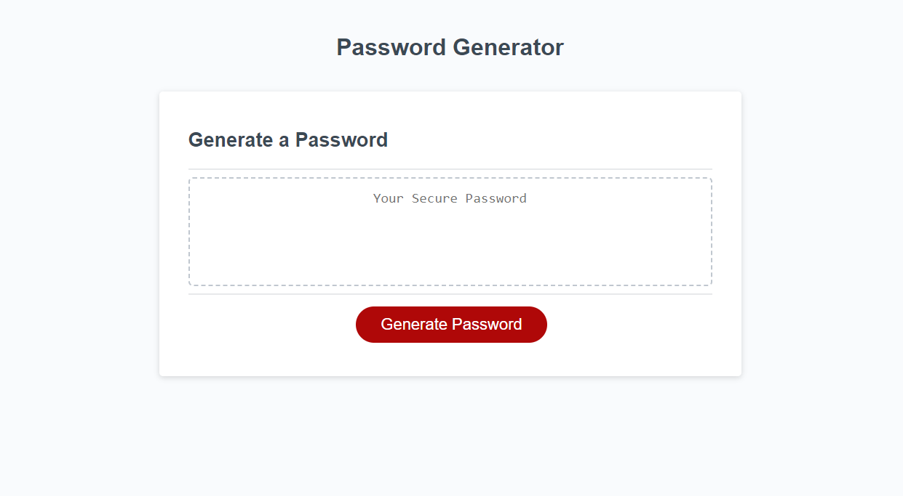
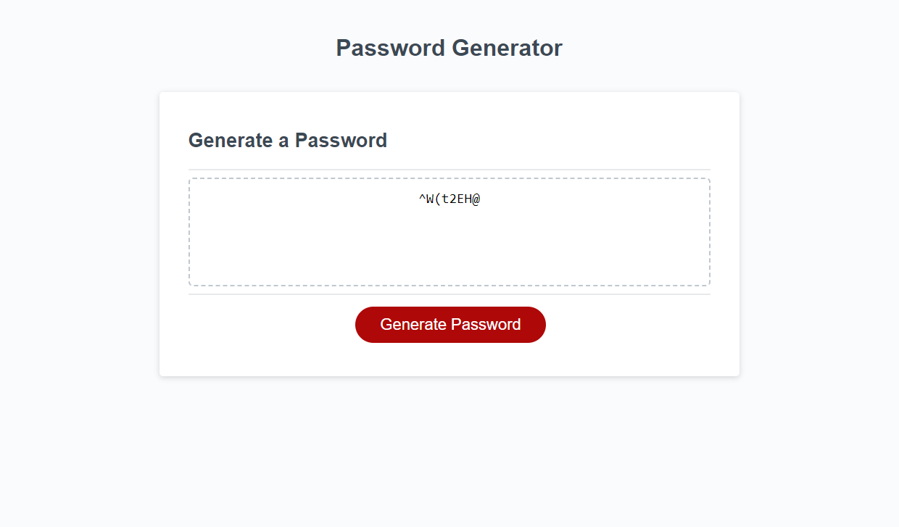

# Password Generator - challenge 3

The project can be located at:
https://christophgonz.github.io/challenge-3-password-gen/

The repository for the project can be located at:
https://github.com/Christophgonz/challenge-3-password-gen

## Description

This goal of the project is to become more familiar with JavaScript.
I made this project in order to create a way to generate a secure password with specific requirements.
It helped me understand more of the specifics of JavaScript and how to use what I've learned in class in a practical manner.

## Usage

After visiting the site you can generate the password by pressing the appropriately labeled button. The site will prompt you for the length of the password and what types of characters you would like in your password (uppercase, lowercase, numerical, and special). The generated password will appear on the screen.

## Credits

Code borrowed from the top result of https://stackoverflow.com/questions/1349404/generate-random-string-characters-in-javascript
